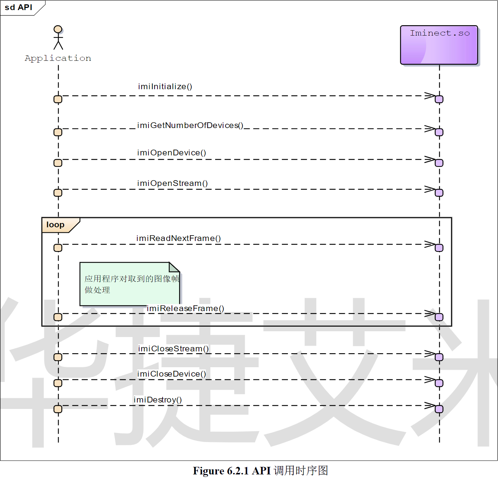
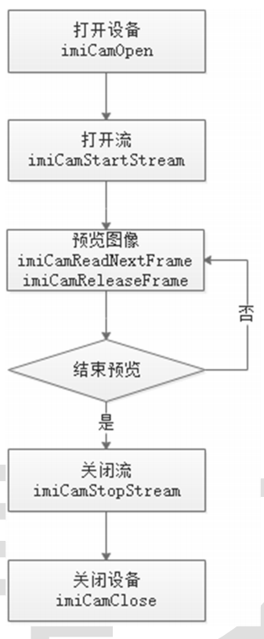

# ImiNect 接⼝定义

## 初始化

### ImiSDK 初始化函数

```cpp
  int32_t imiInitialize()
```

ImiSDK初始化函数

|  值   |              说明               |
|:----:|:-----------------------------:|
|  0   |             操作成功              |
| 小于 0 | 操作失败，imiGetLastError()获取详细错误码 |

> **错误码**
> 0x8030010d 不支持的驱动类型
> 0x80300301 USB初始化失败

```cpp 
  int32_t imiInitialize2(ImiDriverInfo* mDriverInfo)
```

ImiSDK初始化函数 2；支持 USB、FILE、NET三种驱动类型设定

|     Type      |    Name     |       Description        | IN/OUT |
|:-------------:|:-----------:|:------------------------:|:------:|
| ImiDriverInfo | mDriverInfo | 数据驱动类型信息，见 ImiDriverInfo |   IN   |

|  值   |              说明               |
|:----:|:-----------------------------:|
|  0   |             操作成功              |
| 小于 0 | 操作失败，imiGetLastError()获取详细错误码 |

> **错误码**
> 0x8030010d 不支持的驱动类型
> 0x80300301 USB初始化失败

## 设备操作

### 获取系统中 Iminect 设备列表和个数

```c++ 
  int32_t imiGetDeviceList(ImiDeviceAttribute** pDeviceList, int32_t* pDeviceCount)
```

|         Type         |     Name     | Description | IN/OUT |
|:--------------------:|:------------:|:-----------:|:------:|
| ImiDeviceAttribute** | pDeviceList  |  指向设备列表的指针  |   IN   |
|       int32_t*       | pDeviceCount |  指向设备数量的指针  |   IN   |

|  值   |              说明               |
|:----:|:-----------------------------:|
|  0   |             操作成功              |
| 小于 0 | 操作失败，imiGetLastError()获取详细错误码 |

> **错误码**
> 0x80300101 设备未初始化

### 打开设备

```c++ 
  int32_t imiOpenDevice (const char* pDeviceUri, ImiDeviceHandle* pDevice, int32_t reserve)
```

|       Type       |    Name    |            Description            | IN/OUT |
|:----------------:|:----------:|:---------------------------------:|:------:|
|   const char*    | pDeviceUri | 设备 URI，当此值为 NULL时，默认打开设备列表中的第一个设备 |   IN   | 
| ImiDeviceHandle* |  pDevice   |      指向 ImiDeviceHandle 的指针       |  OUT   |
|     int32_t      |  reserve   |              保留，填 0               |   IN   |

|  值   |              说明               |
|:----:|:-----------------------------:|
|  0   |             操作成功              |
| 小于 0 | 操作失败，imiGetLastError()获取详细错误码 |

> **错误码**
> 0x80300101 设备未初始化
> 0x80300102 设备未打开
> 0x80300103 打开的设备数量超过上限
> 0x80300202 第二个参数为空指针
> 0x80300206 参数取值非法
> 0x80300302 USB打开设备失败

### 关闭设备

```c++ 
  int32_t imiCloseDevice(ImiDeviceHandle device)
```

|      Type       |  Name  |           Description            | IN/OUT |
|:---------------:|:------:|:--------------------------------:|:------:|
| ImiDeviceHandle | device | Devicehandle 由 imiOpenDevice()获得 |   IN   |

|  值   |              说明               |
|:----:|:-----------------------------:|
|  0   |             操作成功              |
| 小于 0 | 操作失败，imiGetLastError()获取详细错误码 |

> 关闭设备前先关闭和释放打开的数据流，见 imiStopStream(), imiDestroyChanelInstance()
**错误码**
> 0x80300101 设备未初始化
> 0x80300102 设备未打开

### 设备属性设置

```c++
  int32_t  imiSetDeviceProperty(ImiDeviceHandle  device, uint32_t  propertyId, const void*  pData, uint32_t dataSize)
  ```

|       Type       |    Name    |           Description            | IN/OUT |
|:----------------:|:----------:|:--------------------------------:|:------:|
| ImiDeviceHandle  |   device   | Devicehandle 由 imiOpenDevice()获得 |   IN   |
|     uint32_t     | propertyId |      属性标识符，见 enum IMI_PROP       |   IN   |
|   const void*    |   pData    |            指向属性内容的指针             |   IN   |
| int32_t dataSize |  ataSize   |              属性内容长度              |   IN   |

|  值   |              说明               |
|:----:|:-----------------------------:|
|  0   |             操作成功              |
| 小于 0 | 操作失败，imiGetLastError()获取详细错误码 |

> **错误码**
> 0x80300101 设备未初始化
> 0x80300102 设备未打开
> 0x80300109 空指针异常
> 0x8030010b 设置属性值失败
> 0x80300203 第三个参数为空指针
> 0x80300206 参数取值非法

### 设备属性设置回调

```c++
int32_t imiSetDeviceStateCallback(ImiDeviceStateCallback callback, void* pData)
```

|          Type          |   Name   |           Description            | IN/OUT |
|:----------------------:|:--------:|:--------------------------------:|:------:|
| ImiDeviceStateCallback | callback |          Imi 设备状态变化通知函数          |   IN   |
|         void*          |  pData   | 用户数据，在 ImiDeviceStateCallback 做入 |        |
|          参传回           |    IN    |                                  |        |

|  值   |              说明               |
|:----:|:-----------------------------:|
|  0   |             操作成功              |
| 小于 0 | 操作失败，imiGetLastError()获取详细错误码 |

> **错误码**
> 0x80300101 设备未初始化
> 0x80300201 第一个参数为空指针

### 获取设备属性

```c++
  int32_t  imiGetDeviceProperty(ImiDeviceHandle  device, uint32_t  propertyId, void*  pData, uint32_t* pDataSize) 
  ``````

|       Type       |    Name    |           Description            | IN/OUT |
|:----------------:|:----------:|:--------------------------------:|:------:|
| ImiDeviceHandle  |   device   | Devicehandle 由 imiOpenDevice()获得 |   IN   |
|     uint32_t     | propertyId |      属性标识符，见 enum IMI_PROP       |   IN   |
|   const void*    |   pData    |            指向属性内容的指针             |  OUT   |
| int32_t dataSize | pDataSize  |              属性内容长度              |  OUT   |

|  值   |              说明               |
|:----:|:-----------------------------:|
|  0   |             操作成功              |
| 小于 0 | 操作失败，imiGetLastError()获取详细错误码 |

> **错误码**
> 0x80300101 设备未初始化
> 0x80300102 设备未打开
> 0x80300109 空指针异常
> 0x8030010c 获取属性值失败
> 0x80300203 第三个参数为空指针
> 0x80300206 参数取值非法

### 获取版本信息

```c++
int32_t imiGetVersion(ImiDeviceHandle device, ImiVersions* pImiVersion)
```

|      Type       |    Name     |           Description            | IN/OUT |
|:---------------:|:-----------:|:--------------------------------:|:------:|
| ImiDeviceHandle |   device    | Devicehandle 由 imiOpenDevice()获得 |   IN   |
|  ImiVersions*   | pImiVersion |               版本信息               |   IN   |

|  值  |              说明               |
|:---:|:-----------------------------:|
|  0  |             操作成功              |
| 非零值 | 操作失败，imiGetLastError()获取详细错误码 |

> **可能的错误码**：
> 0x80300101 设备未初始化
> 0x80300102 设备找不到
> 0x8030010c 获取属性值失败
> 0x80300202 第二个参数为空指针
> 0x80300206 参数取值非法
> 0x8030020a 空指针异常

### 获取最近一次操作失败的原因码

```c++
int32_t imiGetLastError() 
```

| 返回值 |  说明   |
|:---:|:-----:|
| 整形值 | 详细错误码 |

### 获取错误码对应的文字说明

```c++
const char* imiGetErrorString(int32_t nErrorCode)
```

|  Type   |    Name    |           Description           | IN/OUT |
|:-------:|:----------:|:-------------------------------:|:------:|
| int32_t | nErrorCode | nErrorCode 由 imiGetLastError 获得 |   IN   |

|  值  |      说明      |
|:---:|:------------:|
| 字符串 |  错误码对应的文字说明  |
|  空  | 获取失败，不存在该错误码 |

> **可能的错误码**：
> 0x80300206 参数取值非法

### 设置日志生成路径

```c++
int32_t imiSetLogOutputDir(const char* pOutputDir)

```

|    Type     |    Name    | Description | IN/OUT |
|:-----------:|:----------:|:-----------:|:------:|
| const char* | pOutputDir |    目标路径     |   IN   |

|  值   |              说明               |
|:----:|:-----------------------------:|
|  0   |             操作成功              |
| 小于 0 | 操作失败，imiGetLastError()获取详细错误码 |

> **可能的错误码**：
> 0x80300002 打开文件失败
> 0x80300201 第一个参数为空指针
> 0x80300206 参数取值非法

### 设置日志级别

```c++
int32_t imiSetLogLevel(uint32_t level)
```

|   Type   | Name  |                      Description                       | IN/OUT |
|:--------:|:-----:|:------------------------------------------------------:|:------:|
| uint32_t | level | 日志级别： 0: Verbose, 1: Information, 2: Warning, 3: Error |   IN   |

|  值   |              说明               |
|:----:|:-----------------------------:|
|  0   |             操作成功              |
| 小于 0 | 操作失败，imiGetLastError()获取详细错误码 |

> **可能的错误码**：
> 0x80300206 参数取值非法

### 查询设备配准是否打开

```c++
ImiBOOL imiIsImageRegistrationEnable(ImiDeviceHandle device)
```

|      Type       |  Name  | Description | IN/OUT |
|:---------------:|:------:|:-----------:|:------:|
| ImiDeviceHandle | device |     设备      |   IN   |

|     值     |  说明   |
|:---------:|:-----:|
| IMI_TRUE  | 配准已打开 |
| IMI_FALSE | 配准未打开 |

### 设置设备配准

```c++
int32_t  imiSetImageRegistration(ImiDeviceHandle device, ImiBOOL bEnable)
```

|      Type       |  Name   |          Description           | IN/OUT |
|:---------------:|:-------:|:------------------------------:|:------:|
| ImiDeviceHandle | device  |               设备               |   IN   |
|     ImiBOOL     | bEnable | IMI_TRUE: 打开配准 IMI_FALSE: 关闭配准 |   IN   |

|  值   |              说明               |
|:----:|:-----------------------------:|
|  0   |             操作成功              |
| 小于 0 | 操作失败，imiGetLastError()获取详细错误码 |

### 获取设备支持能力

```c++
int32_t imiGetSupportCapacity(ImiDeviceHandle device, ImiSupportCapacity* pImiSupportCapacity)
```

|        Type         |        Name         | Description | IN/OUT |
|:-------------------:|:-------------------:|:-----------:|:------:|
|   ImiDeviceHandle   |       device        |     设备      |   IN   |
| ImiSupportCapacity* | pImiSupportCapacity |  设备能力信息结构体  |   IN   |

|  值  |              说明               |
|:---:|:-----------------------------:|
|  0  |             操作成功              |
| 非零值 | 操作失败，imiGetLastError()获取详细错误码 |

## 数据帧操作

### 获取支持的帧属性

```c++
int32_t imiGetSupportFrameMode(ImiDeviceHandle device, ImiFrameType frameType, const ImiFrameMode** pMode, uint32_t* pNumber)
```

|         Type         |   Name    |                                                                                                               Description                                                                                                               | IN/OUT |
|:--------------------:|:---------:|:---------------------------------------------------------------------------------------------------------------------------------------------------------------------------------------------------------------------------------------:|:------:|
|   ImiDeviceHandle    |  device   |                                                                                                    Devicehandle 由 imiOpenDevice()获得                                                                                                     |   IN   |
|     ImiFrameType     | frameType |                                                                                                     Frame type，见 enum ImiFrameType                                                                                                      |   IN   |
| const ImiFrameMode** |   pMode   | 所有支持的帧模式。指针数组，内存由SDK管理 <br/>用法：<br />const ImiFrameMode* pMode = NULL; <br/> uint32_t number = 0;<br/> int32_t ret = imiGetSupportFrameMode(device1, type1, &pMode, &number);<br/> 当支持的帧模式个数大于 0 时，取值如下：<br/>pMode[0]...pMode[number-1] |  OUT   |
|      uint32_t*       |  pNumber  |                                                                                                             指向支持的帧模式的个数的指针                                                                                                              |  OUT   |

|  值   |              说明               |
|:----:|:-----------------------------:|
|  0   |             操作成功              |
| 小于 0 | 操作失败，imiGetLastError()获取详细错误码 |

> **错误码**
> 0x80300101 设备未初始化
> 0x80300102 设备未打开
> 0x80300203 第三个参数为空指针
> 0x80300204 第四个参数为空指针
> 0x80300207 非法的帧类型

### 设置帧模式

```c++
int32_t imiSetFrameMode(ImiDeviceHandle device, ImiFrameType frameType, ImiFrameMode* pMode)
```

|      Type       |   Name    |               Description               | IN/OUT |
|:---------------:|:---------:|:---------------------------------------:|:------:|
| ImiDeviceHandle |  device   |    Devicehandle 由 imiOpenDevice()获得     |   IN   |
|  ImiFrameType   | frameType |     Frame type，见 enum ImiFrameType      |   IN   |
|  ImiFrameMode*  |   pMode   | 指向帧模式的指针，见ImiFrameMode。设置时只需要填写像素格式和分辨率 |   IN   |

|  值   |              说明               |
|:----:|:-----------------------------:|
|  0   |             操作成功              |
| 小于 0 | 操作失败，imiGetLastError()获取详细错误码 |

> **错误码**
> 0x80300101 设备未初始化
> 0x80300102 设备未打开
> 0x80300109 空指针异常
> 0x8030010b 设置属性值失败
> 0x80300206 参数取值非法
> 0x80300207 非法的帧类型

### 获取当前帧模式

```c++
const ImiFrameMode* imiGetCurrentFrameMode(ImiDeviceHandle device, ImiFrameType frameType)
```

|      Type       |   Name    |           Description            | IN/OUT |
|:---------------:|:---------:|:--------------------------------:|:------:|
| ImiDeviceHandle |  device   | Devicehandle 由 imiOpenDevice()获得 |   IN   |
|  ImiFrameType   | frameType |  Frame type，见 enum ImiFrameType  |   IN   |

|  值   |                     说明                      |
|:----:|:-------------------------------------------:|
| 非空指针 | 操作成功，指针中存储了 frameType 的帧当前模式，见 ImiFrameMode |
| 空指针  |        操作失败，imiGetLastError()获取详细错误码        |

> **错误码**
> 0x80300101 设备未初始化
> 0x80300102 设备未打开
> 0x80300207 非法的帧类型

### 设置红外输出

```c++
int32_t imiSetOutput8BitIrData(ImiDeviceHandle device, ImiBOOL bEnable)
```

|      Type       |  Name   |           Description            | IN/OUT |
|:---------------:|:-------:|:--------------------------------:|:------:|
| ImiDeviceHandle | device  | Devicehandle 由 imiOpenDevice()获得 |   IN   |
|     ImiBOOL     | bEnable |          设置是否输出红外 8Bit           |   IN   |

|  值  |              说明               |
|:---:|:-----------------------------:|
|  0  |             操作成功              |
| 非零值 | 操作失败，imiGetLastError()获取详细错误码 |

### 设置图像的顺时针旋转角度

```c++
int32_t imiSetRotationAngle(ImiDeviceHandle device, ImiRotationAngle rotationAngle);
```

|        Type        |     Name      |                                                                             Description                                                                             | IN/OUT |
|:------------------:|:-------------:|:-------------------------------------------------------------------------------------------------------------------------------------------------------------------:|:------:|
|  ImiDeviceHandle   |    device     |                                                                  Devicehandle 由 imiOpenDevice()获得                                                                   |   IN   |
| ImImiRotationAngle | rotationAngle | 顺时针旋转角度:<br/> IMI_ROTATION_ANGLE_0: 顺时针旋转 0 度 <br/>IMI_ROTATION_ANGLE_90：顺时针旋转 90 度 <br/>IMI_ROTATION_ANGLE_180：顺时针旋转 180 度 <br/>IMI_ROTATION_ANGLE_270：顺时针旋转 270 度 |   IN   |

|  值  |              说明               |
|:---:|:-----------------------------:|
|  0  |             操作成功              |
| 非零值 | 操作失败，imiGetLastError()获取详细错误码 |

## 数据流操作

### 打开指定的数据流

```c++
int32_t imiOpenStream(ImiDeviceHandle device, ImiFrameType frameType, ImiNewFrameCallback callback, void* pData, ImiStreamHandle* pStream)
```

|        Type         |   Name    |           Description            | IN/OUT |
|:-------------------:|:---------:|:--------------------------------:|:------:|
|   ImiDeviceHandle   |  device   | Devicehandle 由 imiOpenDevice()获得 |   IN   |
|    ImiFrameType     | frameType |  Frame type，见 enum ImiFrameType  |   IN   |
| ImiNewFrameCallback | callback  |         新数据帧到达通知回调函数，可为空         |   IN   |
|        void*        |   pData   |  用户数据，做 ImiNewFrameCallback 入参   |   IN   |
|  ImiStreamHandle*   |  pStream  |       用于保存 Stream 句柄的内存地址        |  OUT   |

|  值   |              说明               |
|:----:|:-----------------------------:|
|  0   |             操作成功              |
| 小于 0 | 操作失败，imiGetLastError()获取详细错误码 |

> **错误码**
> 0x80300101 设备未初始化
> 0x80300101 设备未初始化
> 0x80300102 设备未打开
> 0x80300104 设备已断开
> 0x80300105 流未找到
> 0x80300106 打开流的数量超过上限
> 0x8030010f 加载 h264 解码库失败
> 0x80300110 导入 h264 解码库 API 失败
> 0x80300205 第五个参数为空指针
> 0x80300207 非法的帧类型

### 关闭指定的数据流

```c++
int32_t imiCloseStream(ImiStreamHandle Stream)
```

|      Type       |  Name  |        Description        | IN/OUT |
|:---------------:|:------:|:-------------------------:|:------:|
| ImiStreamHandle | Stream | Stream 句柄，由 OpenStream 得到 |   IN   |

|  值   |              说明               |
|:----:|:-----------------------------:|
|  0   |             操作成功              |
| 小于 0 | 操作失败，imiGetLastError()获取详细错误码 |

> **错误码**
> 0x80300101 设备未初始化
> 0x80300105 流未找到

### 读下一帧数据

```c++
int32_t imiReadNextFrame(ImiStreamHandle Stream, ImiImageFrame** ppFrame, int32_t timeout) 
```

|      Type       |  Name   |      Description       | IN/OUT |
|:---------------:|:-------:|:----------------------:|:------:|
| ImiStreamHandle | Stream  |         数据流句柄          |   IN   |
| ImiImageFrame** | ppFrame | 保存 ImiImageFrame 指针的地址 |  OUT   |
|     int32_t     | timeout |      等待时长，毫秒（ms）       |   IN   |

|  值   |              说明               |
|:----:|:-----------------------------:|
|  0   |             操作成功              |
| 小于 0 | 操作失败，imiGetLastError()获取详细错误码 |

> 当前数据流没有数据，将阻塞等待到有新帧到来或超时。
> ImiImageFrame 使用结束后，使用 imiReleaseFrame()，释放引用。
**错误码**：
> 0x80300001 系统调用失败
> 0x80300101 设备未初始化
> 0x80300105 流找不到
> 0x80300107 没有帧数据
> 0x8030010a 等待超时
> 0x80300201 第一个参数为空指针
> 0x80300202 第二个参数为空指针
> 0x80300206 参数取值非法

### 释放帧引用

```c++
int32_t imiReleaseFrame(ImiImageFrame** pFrame)
```

|      Type       |  Name  |      Description       | IN/OUT |
|:---------------:|:------:|:----------------------:|:------:|
| ImiImageFrame** | pFrame | 指向 ImiImageFrame 指针的地址 |   IN   |

|  值   |              说明               |
|:----:|:-----------------------------:|
|  0   |             操作成功              |
| 小于 0 | 操作失败，imiGetLastError()获取详细错误码 |

> miImageFrame 使用结束后，应尽快使用 imiReleaseFrame()，释放引用。默认读取 5 帧。
**可能的错误码**：
> 0x80300101 设备未初始化
> 0x80300201 第一个参数为空指针

## 录制文件

### 创建录制器

```c++
int32_t imiCreateRecorder(const char* pFileToSave, ImiRecordHandle* pRecorder) 
```

|       Type       |    Name     |            Description             | IN/OUT |
|:----------------:|:-----------:|:----------------------------------:|:------:|
|   const char*    | pFileToSave | 指向文件保存路径的指针，文件路径包含文件名。如”c:/1.data” |   IN   |
| ImiRecordHandle* |  pRecorder  |       用于保存 Recorder 句柄的内存地址        |  OUT   |

|  值  |              说明               |
|:---:|:-----------------------------:|
|  0  |             操作成功              |
| 非0值 | 操作失败，imiGetLastError()获取详细错误码 |

#### 录制回放使用方式

> 1. 调用 imiInitialize2，指定驱动类型为 FILE，指定文件路径或修改配置文件 imi.ini,确认[Common]
     Driver=Dummy，然后配置Data文件路径， [File_Driver] Record_File_Path="c:/1.data"
>  2. 调用 openStream 等接口回放，流程与正常使用 iminect 设备流程一致

> **可能的错误码**：
> 0x80300002 打开文件失败
> 0x80300101 设备未初始化
> 0x80300102 设备未打开
> 0x80300104 设备已断开
> 0x80300106 打开的记录器数量超过上限

### 将已打开的流附加到记录器

```c++
int32_t imiRecorderAttachStream(ImiRecordHandle recorder, ImiStreamHandle stream, ImiDataType dataType, ImiBOOL bCompress)
```

|      Type       |   Name    |         Description          | IN/OUT |
|:---------------:|:---------:|:----------------------------:|:------:|
| ImiRecordHandle | recorder  |         Recorder 句柄          |   IN   |
| ImiStreamHandle |  stream   |  stream 由 imiOpenStream()获得  |   IN   |
| int3ImiDataType | dataType  | Data type，见 enum ImiDataType |   IN   |
|     ImiBOOL     | bCompress |             是否压缩             |   IN   |

|  值  |              说明               |
|:---:|:-----------------------------:|
|  0  |             操作成功              |
| 非零值 | 操作失败，imiGetLastError()获取详细错误码 |

> 只是将流附加到记录器，并未开始记录
> **可能的错误码**：
> 0x80300101 设备未初始化
> 0x80300105 记录流未找到
> 0x80300108 记录器未找到
> 0x80300209 非法的数据类型

### 开启记录器

```c++
int32_t imiRecorderStart(ImiRecordHandle recorder) 
```

|      Type       |   Name   |            Description             | IN/OUT |
|:---------------:|:--------:|:----------------------------------:|:------:|
| ImiRecordHandle | recorder | Recorder 句柄，由 imiCreateRecorder 得到 |   IN   |

|  值  |              说明               |
|:---:|:-----------------------------:|
|  0  |             操作成功              |
| 非零值 | 操作失败，imiGetLastError()获取详细错误码 |

> **可能的错误码**：
> 0x80300101 设备未初始化
> 0x80300108 记录器未找到

### 关闭记录器

```c++
int32_t imiRecorderStop(ImiRecordHandle recorder)
```

|      Type       |   Name   |            Description             | IN/OUT |
|:---------------:|:--------:|:----------------------------------:|:------:|
| ImiRecordHandle | recorder | Recorder 句柄，由 imiCreateRecorder 得到 |   IN   |

|  值  |              说明               |
|:---:|:-----------------------------:|
|  0  |             操作成功              |
| 非零值 | 操作失败，imiGetLastError()获取详细错误码 |

> 只会暂停记录，可以再次调用 imiRecorderStart 继续记录
> **可能的错误码**：
> 0x80300101 设备未初始化
> 0x80300108 记录器未找到

### 销毁记录器

```c++
int32_t imiDestroyRecorder(ImiRecordHandle recorder) 
```

|      Type       |   Name   |            Description             | IN/OUT |
|:---------------:|:--------:|:----------------------------------:|:------:|
| ImiRecordHandle | recorder | Recorder 句柄，由 imiCreateRecorder 得到 |   IN   |

|  值  |              说明               |
|:---:|:-----------------------------:|
|  0  |             操作成功              |
| 非零值 | 操作失败，imiGetLastError()获取详细错误码 |

> **可能的错误码**：
> 0x80300101 设备未初始化
> 0x80300108 记录器未找到

## 拍照保存bmp文件

```c++
int32_t  imiTakePhoto (const char* pBmpImagePath)
```

|    Type     |     Name      | Description | IN/OUT |
|:-----------:|:-------------:|:-----------:|:------:|
| const char* | pBmpImagePath | 指向图片保存路径的指针 |   IN   |

|  值   |              说明               |
|:----:|:-----------------------------:|
|  0   |             操作成功              |
| 小于 0 | 操作失败，imiGetLastError()获取详细错误码 |

## 深度图转换

### 深度图转彩色图

```c++
int32_t imiConvertCoordinateDepthToColor (ImiCoordinateConvertMode convertMode, uint32_t depthX, uint32_t depthY, uint16_t depthZ, uint32_t* pImageX, uint32_t* pImageY)
```

|           Type           |    Name     |  Description   | IN/OUT |
|:------------------------:|:-----------:|:--------------:|:------:|
| ImiCoordinateConvertMode | convertMode | 深度坐标到彩色坐标的转换模式 |   IN   |
|         uint32_t         |   depthX    |    深度图 X 坐标    |   IN   |
|         uint32_t         |   depthY    |    深度图 Y 坐标    |   IN   |
|         uint16_t         |   depthZ    |  深度图 Z 坐标，深度   |   IN   |
|        uint32_t*         |   pImageX   | 指向彩色图 X 坐标的指针  |  OUT   |
|        uint32_t*         |   pImageY   | 指向彩色图 Y 坐标的指针  |  OUT   |

|  值   |              说明               |
|:----:|:-----------------------------:|
|  0   |             操作成功              |
| 小于 0 | 操作失败，imiGetLastError()获取详细错误码 |

### 深度图转世界坐标

```c++
int32_t  imiConvertCoordinateDepthToWorld(ImiVector4*  pDst,  const  ImiVector4I*  pSrc,  int32_t height, int32_t width)
```

|     Type     |  Name  |  Description  | IN/OUT |
|:------------:|:------:|:-------------:|:------:|
| ImiVector4*  |  pDst  | 指向输出的世界坐标的指针  |  OUT   |
| ImiVector4I* |  pSrc  | 指向输入的深度图坐标的指针 |   IN   |
|   int32_t    | height |     深度图高      |   IN   |
|   int32_t    | width  |     深度图宽      |   IN   |

|  值   |              说明               |
|:----:|:-----------------------------:|
|  0   |             操作成功              |
| 小于 0 | 操作失败，imiGetLastError()获取详细错误码 |

> **可能的错误码**：
> 0x80300206 参数取值非法

### 世界坐标转深度图

```C++
int32_t  imiConvertCoordinateWorldToDepth(ImiVector4I*  pDst,  const  ImiVector4*  pSrc,  int32_t height, int32_t width)
```

|     Type     |  Name  |  Description  | IN/OUT |
|:------------:|:------:|:-------------:|:------:|
| ImiVector4*  |  pDst  | 指向输出的世界坐标的指针  |  OUT   |
| ImiVector4I* |  pSrc  | 指向输入的深度图坐标的指针 |   IN   |
|   int32_t    | height |     深度图高      |   IN   |
|   int32_t    | width  |     深度图宽      |   IN   |

|  值   |              说明               |
|:----:|:-----------------------------:|
|  0   |             操作成功              |
| 小于 0 | 操作失败，imiGetLastError()获取详细错误码 |

### 深度图转点云

```c++
int32_t imiConvertDepthToPointCloud(const ImiImageFrame* pDepth, float factor, float fx, float fy, float cx, float cy, ImiPoint3D* pPointClouds)
```

|         Type         |     Name     |     Description      | IN/OUT |
|:--------------------:|:------------:|:--------------------:|:------:|
| const ImiImageFrame* |    pDepth    |      指向深度数据的指针       |   IN   |
|        float         |    factor    |    camera_factor     |   IN   |
|        float         |      fx      |      camera_fx       |   IN   |
|        float         |      fy      |      camera_fy       |   IN   |
|        float         |      cx      |      camera_cx       |   IN   |
|        float         |      cy      |      camera_cy       |   IN   |
|     ImiPoint3D*      | pPointClouds | 输出的点云数据（buffer 由调用者申 |        |
|          请）          |     OUT      |                      |        |

|  值   |              说明               |
|:----:|:-----------------------------:|
|  0   |             操作成功              |
| 小于 0 | 操作失败，imiGetLastError()获取详细错误码 |

> factor：若输出点云坐标以 m 为单位，传入 1000.0
> fx：相机内部参考，x 轴归一化焦距，以像素单位表示
> fy：相机内部参考，y 轴归一化焦距，以像素单位表示
> cx：相机内部参考，主点（通常在图像中心）的 x 轴坐标值
> cy：相机内部参考，主点（通常在图像中心）的 y 轴坐标值
> ImiPoint3D：参考结构体 ImiPoint3D 定义
> 若 factor、fx、fy、cx、cy 其中任何一个小于等于 0，这几个参数将使用默认值

## Camera操作

### 获取Camera属性

```c++
int32_t getCamAttrList(ImiCamAttribute** pList, int32_t* nCount)
```

|       Type        |  Name  | Description | IN/OUT |
|:-----------------:|:------:|:-----------:|:------:|
| ImiCamAttribute** | pList  | Camera 属性列表 |  OUT   |
|     int32_t*      | nCount |    列表的个数    |  OUT   |

|  值   |              说明               |
|:----:|:-----------------------------:|
|  0   |             操作成功              |
| 小于 0 | 操作失败，imiGetLastError()获取详细错误码 |

### 打开uvc camera
#### 通用
```c++
int32_t imiCamOpenURI(const char* pURI, ImiCameraHandle* pCameraDevice)
```

|       Type       |     Name      | Description  | IN/OUT |
|:----------------:|:-------------:|:------------:|:------:|
|   const char*    |     pURI      | Camera 的 URI |   IN   |
| ImiCameraHandle* | pCameraDevice | Camera 的句柄指针 |  OUT   |

|  值   |  说明  |
|:----:|:----:|
|  0   | 操作成功 |
| 小于 0 | 操作失败 |

#### 打开UVC Camera, 仅支持在Windows上使用
```c++
int32_t imiCamOpen (ImiCameraHandle* pCameraDevice)
```

|       Type       |     Name      | Description  | IN/OUT |
|:----------------:|:-------------:|:------------:|:------:|
|   ImiCameraHandle*    |     pCameraDevice     | 指向CameraDevice的指针 |  OUT   |


|  值   |  说明  |
|:----:|:----:|
|  0   | 操作成功 |
| 小于 0 | 操作失败 |

#### 打开UVC Camera, 仅支持在Android平台上使用
```c++
int32_t imiCamOpen2(int32_t vid, int32_t pid, int32_t fd, int32_t busnum, int32_t devaddr, const char 
*usbfs, ImiCameraHandle* pCameraDevice) 
```


|       Type       |     Name      |            Description            | IN/OUT |
|:----------------:|:-------------:|:---------------------------------:|:------:|
|   int32_t    |      vid      |            设备VendorID             |   IN   |
|   int32_t    |      pid      |            设备ProductID            |   IN   |
|   int32_t    |      fd       |   UVC Camera在android上挂载的设备节点描述符   |      IN       |
|   int32_t    |    busnum     |  UVC Camera在android上的设备节点    编号   |      IN       |
|   int32_t    |    devaddr    |     UVC Camera 在android上的设备地址     |   IN   |
|   const char    |    *usbfs     |    UVC Camera 在android上的设备URI     |   IN   |
|   ImiCameraHandle*    | pCameraDevice |         指向CameraDevice的指针         |  OUT   |

|  值   |  说明  |
|:----:|:----:|
|  0   | 操作成功 |
| 小于 0 | 操作失败 |

### 关闭uvc camera

```c++
int32_t imiCamCloseURI(ImiCameraHandle cameraDevice)
```

|      Type       |     Name     | Description | IN/OUT |
|:---------------:|:------------:|:-----------:|:------:|
| ImiCameraHandle | cameraDevice | Camera 的句柄  |   IN   |

|  值   |  说明  |
|:----:|:----:|
|  0   | 操作成功 |
| 小于 0 | 操作失败 |

### 关闭打开的Camera

```c++
int32_t imiCamClose(ImiCameraHandle cameraDevice)
```

|      Type       |     Name     | Description | IN/OUT |
|:---------------:|:------------:|:-----------:|:------:|
| ImiCameraHandle | cameraDevice | Camera 的句柄  |   IN   |

|  值   |  说明  |
|:----:|:----:|
|  0   | 操作成功 |
| 小于 0 | 操作失败 |

### 获取相机支持的帧模式

```c++
int32_t imiCamGetSupportFrameModes(ImiCameraHandle cameraDevice, const ImiCameraFrameMode** pModes,uint32_t* pNumber)
```

|            Type            |     Name     |       Description        | IN/OUT |
|:--------------------------:|:------------:|:------------------------:|:------:|
|      ImiCameraHandle       | cameraDevice |     Camera Device 句柄     |   IN   |
| const ImiCameraFrameMode** |    pModes    | 支持的 Camera frame mode 列表 |  OUT   |
|         uint32_t*          |   pNumber    |         支持的模式个数          |  OUT   |

|  值   |  说明  |
|:----:|:----:|
|  0   | 操作成功 |
| 小于 0 | 操作失败 |

### 获取相机当前的帧模式

```c++
const ImiCameraFrameMode* imiCamGetCurrentFrameMode(ImiCameraHandle cameraDevice)
```

|      Type       |     Name     |   Description    | IN/OUT |
|:---------------:|:------------:|:----------------:|:------:|
| ImiCameraHandle | cameraDevice | Camera Device 句柄 |   IN   |

|  值   |                            说明                            |
|:----:|:--------------------------------------------------------:|
| 非空指针 | 操作成功，指针中存储了相机当前的 Camera  frame mode，见 ImiCameraFrameMode |
| 空指针  |                           操作失败                           |

### 设置相机帧模式

```c++
int32_t imiCamSetFrameMode(ImiCameraHandle cameraDevice, ImiCameraFrameMode* pMode)
```

|        Type         |     Name     |       Description        | IN/OUT |
|:-------------------:|:------------:|:------------------------:|:------:|
|   ImiCameraHandle   | cameraDevice |     Camera Device 句柄     |   IN   |
| ImiCameraFrameMode* |    pModes    | 支持的 Camera frame mode 列表 |   IN   |

|  值   |  说明  |
|:----:|:----:|
|  0   | 操作成功 |
| 小于 0 | 操作失败 |

### 打开Camera数据流

```c++
int32_t imiCamStartStream(ImiCameraHandle cameraDevice, const ImiCameraFrameMode* pMode)
```

|           Type            |     Name     |       Description        | IN/OUT |
|:-------------------------:|:------------:|:------------------------:|:------:|
|      ImiCameraHandle      | cameraDevice |     Camera Device 句柄     |   IN   |
| const ImiCameraFrameMode* |    pModes    | 指向 Camera frame mode 的指针 |   IN   |

|  值   |  说明  |
|:----:|:----:|
|  0   | 操作成功 |
| 小于 0 | 操作失败 |

```c++
int32_t imiCamStartStream2(ImiCameraHandle cameraDevice)
```

|      Type       |     Name     |   Description    | IN/OUT |
|:---------------:|:------------:|:----------------:|:------:|
| ImiCameraHandle | cameraDevice | Camera Device 句柄 |   IN   |

|  值   |  说明  |
|:----:|:----:|
|  0   | 操作成功 |
| 小于 0 | 操作失败 |

> 此时打开的是默认的分辨率或者通过接口 imiCamSetFrameMode 设置的分辨率

### 关闭Camera数据流

```c++
int32_t imiCamStopStream(ImiCameraHandle cameraDevice)
```

|      Type       |     Name     |   Description    | IN/OUT |
|:---------------:|:------------:|:----------------:|:------:|
| ImiCameraHandle | cameraDevice | Camera Device 句柄 |   IN   |

|  值   |  说明  |
|:----:|:----:|
|  0   | 操作成功 |
| 小于 0 | 操作失败 |

### 读取Camera数据

```c++
int32_t imiCamReadNextFrame(ImiCameraHandle cameraDevice, ImiCameraFrame** pFrame, int32_t timeout)
```

|       Type       |     Name     |   Description    | IN/OUT |
|:----------------:|:------------:|:----------------:|:------:|
| ImiCameraHandle  | cameraDevice | Camera Device 句柄 |   IN   |
| ImiCameraFrame** |    pFrame    |   Camera 数据指针    |  OUT   |
|     int32_t      |   timeout    | 读取 Camera 数据的超时时 |   IN   |

|  值   |  说明  |
|:----:|:----:|
|  0   | 操作成功 |
| 小于 0 | 操作失败 |

### 释放读取的Camera

```c++
int32_t imiCamReleaseFrame(ImiCameraFrame** pFrame) 
```

|       Type       |  Name  | Description | IN/OUT |
|:----------------:|:------:|:-----------:|:------:|
| ImiCameraFrame** | pFrame | Camera 数据指针 |   IN   |

|  值   |  说明  |
|:----:|:----:|
|  0   | 操作成功 |
| 小于 0 | 操作失败 |

### 设置Camera的mirror属性

```c++
int32_t imiCamSetMirror(ImiCameraHandle cameraDevice, ImiCAMBOOL bMirror)
```

|      Type       |     Name     |   Description    | IN/OUT |
|:---------------:|:------------:|:----------------:|:------:|
| ImiCameraHandle | cameraDevice | Camera Device 句柄 |   IN   |
|   ImiCAMBOOL    |   bMirror    | 要设置的 Mirror 状态值  |   IN   |

|  值   |  说明  |
|:----:|:----:|
|  0   | 操作成功 |
| 小于 0 | 操作失败 |

### 设置深度流和彩色流同步

```c++
int32_t imiCamSetFramesSync(ImiCameraHandle cameraDevice, bool bSync)
```

|      Type       |     Name     |   Description    | IN/OUT |
|:---------------:|:------------:|:----------------:|:------:|
| ImiCameraHandle | cameraDevice | Camera Device 句柄 |   IN   |
|      bool       |    bSync     |     开启关闭同步功能     |   IN   |

|  值   |  说明  |
|:----:|:----:|
|  0   | 操作成功 |
| 小于 0 | 操作失败 |

> 打开深度流和彩色流之后，设置同步，关闭深度流和彩色流之前，关闭同步

### 设置曝光区域

```c++
int32_t imiCamSetExposureArea(ImiCameraHandle cameraDevice, uint32_t startX, uint32_t startY, uint32_t areaWidth, uint32_t areaHeight)
```

|      Type       |     Name     |   Description    | IN/OUT |
|:---------------:|:------------:|:----------------:|:------:|
| ImiCameraHandle | cameraDevice | Camera Device 句柄 |   IN   |
|    uint32_t     |    startX    |  曝光区域起始位置 X 坐标   |   IN   |
|    uint32_t     |    startY    |  曝光区域起始位置 Y 坐标   |   IN   |
|    uint32_t     |  areaWidth   |      曝光区域宽度      |   IN   |
|    uint32_t     |  areaHeight  |      曝光区域高度      |   IN   |

|  值   |  说明  |
|:----:|:----:|
|  0   | 操作成功 |
| 小于 0 | 操作失败 |

### 清除设置的曝光区域

```c++
int32_t imiCamClearExposureArea(ImiCameraHandle cameraDevice)
```

|      Type       |     Name     |   Description    | IN/OUT |
|:---------------:|:------------:|:----------------:|:------:|
| ImiCameraHandle | cameraDevice | Camera Device 句柄 |   IN   |

|  值   |  说明  |
|:----:|:----:|
|  0   | 操作成功 |
| 小于 0 | 操作失败 |

### RGB转Gray灰度图

```c++
int32_t imiCamSetRGB2Gray(ImiCameraHandle cameraDevice, bool bEnable);
```

|      Type       |     Name     |   Description    | IN/OUT |
|:---------------:|:------------:|:----------------:|:------:|
| ImiCameraHandle | cameraDevice | Camera Device 句柄 |   IN   |
|      bool       |   bEnable    |  RGB 彩色是否转灰度输出   |   IN   |

|  值   |  说明  |
|:----:|:----:|
|  0   | 操作成功 |
| 小于 0 | 操作失败 |

### 设置彩色图顺时针旋转角度

```c++
int32_t imiCamSetRotationAngle(ImiCameraHandle cameraDevice, ImiCameraRotationAngle rotationAngle);
```

|          Type          |     Name      |                                                                                 Description                                                                                  | IN/OUT |
|:----------------------:|:-------------:|:----------------------------------------------------------------------------------------------------------------------------------------------------------------------------:|:------:|
|    ImiCameraHandle     | cameraDevice  |                                                                               Camera Device 句柄                                                                               |   IN   |
| ImiCameraRotationAngle | rotationAngle | 顺时针旋转角度: CAMERA_ROTATION_ANGLE_0:  顺时针旋转 0 度 <br/>CAMERA_ROTATION_ANGLE_90： 顺时针旋转 90 度 <br/>CAMERA_ROTATION_ANGLE_180：顺时针旋转 180 度 <br/>CAMERA_ROTATION_ANGLE_270：顺时针旋转 270 度 |   IN   |

|  值   |  说明  |
|:----:|:----:|
|  0   | 操作成功 |
| 小于 0 | 操作失败 |

## 其他

### 选择优先跟踪骨架的用户

```c++
int32_t  imiSelectUser(const ImiDeviceHandle device, uint32_t userId)
```

|         Type          |  Name  | Description  | IN/OUT |
|:---------------------:|:------:|:------------:|:------:|
| const ImiDeviceHandle | device |      设       |   IN   |
|       uint32_t        | userId | 优先跟踪骨架的用户 ID |   IN   |

|  值   |              说明               |
|:----:|:-----------------------------:|
|  0   |             操作成功              |
| 小于 0 | 操作失败，imiGetLastError()获取详细错误码 |

### 取消选择优先跟踪骨架的用户

```c++
int32_t  imiUnSelectUser (const ImiDeviceHandle device, uint32_t userId) 
```

|         Type          |  Name  | Description  | IN/OUT |
|:---------------------:|:------:|:------------:|:------:|
| const ImiDeviceHandle | device |      设       |   IN   |
|       uint32_t        | userId | 优先跟踪骨架的用户 ID |   IN   |

|  值   |              说明               |
|:----:|:-----------------------------:|
|  0   |             操作成功              |
| 小于 0 | 操作失败，imiGetLastError()获取详细错误码 |

# Demo

**API调用时序**



**UVC Camera API时序**


## 打开单路流
## 打开普通彩色深度红外图像
file: open_single_stream.cpp
> 不同的流（color，depth，IR）通过设置imiOpenStream的第二个参数（IMI_COLOR_FRAME，IMI_DEPTH_FRAME，IMI_IR_FRAME）来实现

<div align=center>
	
</div>
TODO: 彩色图暂时无法打开

- 深度图的格式

> pixelFormat: 0   
> frameType: 0   
> frameIndex: 158   
> timestamp: 2463839000   
> dataSize: 25   
> width: 480   
> height: 640   
> size: 614400   
> rotationAngle: 0   
> bitPerPixel: 32
## 打开UVC彩色摄像头
<div align=center>
     
</div>
file: open_uvc_camera.cpp      

> ~~无法接收数据, 初始化均正常, int32_t imiCamStartStream(ImiCameraHandle cameraDevice, const ImiCameraFrameMode*
pMode)~~       
> ~~无法开始流~~     
> ~~int32_t imiCamStartStream2(ImiCameraHandle cameraDevice)可以打开流，需要处理下frame才能显示~~            
> ~~pdata是raw数据, 需要进行去拜耳阵列处理才能转成rgb数据~~
> ~~处理有问题预览不对，还是要参照sdk的bmp处理流程~~
> 预览正常
> 需要复制编译好的opencv的dll到运行目录
## 打开两路流
> 两路流无法同时打开，只能打开一路流
> TODO: 研究怎么同时显示两路流
### 打开不带UVC彩色流和深度流
<div align=center>
    
</div>

> 不带UVC的彩色图无法打开, ~~怀疑硬件问题~~  不带uvc应该需要特殊解码

### 打开带UVC彩色流和深度流
> 同时预览只有UVC彩色图显示, 深度图log显示有数据但无法显示
<div align=center>
    
</div>
file: open_two_stream.cpp